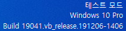

# glovepie-wiimote

[English](./README.md) | [Korean](./README.ko.md)

Control games with Nintendo Wii Remote in Windows.

## Installation

1. Download and unzip the following files.
   - <https://github.com/elitak/PPJoy/releases/download/v0.8.4.6/PPJoySetup-0.8.4.6.zip>
   - <https://github.com/Ravbug/GlovePIE/releases/download/Release/GlovePIE-0.43.zip>
1. If the computer is not running in test mode, run
   `bcdedit -set TESTSIGNING ON` as administrator and restart the computer.
   Then, execute `PPJoySetup-0.8.4.6.exe` to run the PPJoy driver. If a new
   window appears, click "Add -> Add -> Done" to add a new joystick.  
     
   The above watermark will appear in the bottom corner of the screen, which is
   necessary to run the PPJoy driver. To remove the watermark, run
   `bcdedit -set TESTSIGNING OFF` as administrator and restart the computer.

## Running

1. Turn Bluetooth on and open the Control Panel. Click "Add a device" below
   "Hardware and Sound" and press the <kbd>1</kbd> and <kbd>2</kbd> buttons of
   the Wiimote until the device is recognized by the computer. Then, click
   "Cancel -> Cancel" to install the necessary files.
1. Execute `GlovePIE.exe` and click "File -> Open" to open a `*.PIE` script.
   Then, click "Run" to run the script. Now you can play games with the Wiimote
   while GlovePIE is running.
1. To stop, click the "Stop" button in GlovePIE and disconnect the Wiimote from
   the computer.

## GlovePIE Scripts

The following is an example of a GlovePIE script. Visit the
[GlovePIE Wiki](https://github.com/Ravbug/GlovePIE/wiki)<sup>([Syntax](https://github.com/Ravbug/GlovePIE/wiki/GlovePIE-Scripts-and-Syntax), [Wiimote](<https://github.com/Ravbug/GlovePIE/wiki/Wiimote-(Nintendo-Wii-Remote)>), [PPJoy](https://github.com/Ravbug/GlovePIE/wiki/Joysticks,-PPJoy,-and-Kinect#ppjoy))</sup>
for more information.

```rust
PPJoy.Analog0 = Smooth(MapRange(Wiimote.SmoothPitch, -80, 80, -1, 1))
PPJoy.Digital0 = Wiimote.Up
PPJoy.Digital1 = Wiimote.Down
PPJoy.Digital2 = Wiimote.Left
PPJoy.Digital3 = Wiimote.Right
PPJoy.Digital4 = Wiimote.A
PPJoy.Digital5 = Wiimote.B
PPJoy.Digital6 = Wiimote.Minus
PPJoy.Digital7 = Wiimote.Plus
PPJoy.Digital8 = Wiimote.Home
PPJoy.Digital9 = Wiimote.One
PPJoy.Digital10 = Wiimote.Two
```

## Euro Truck Simulator 2 Configuration

Set the "Steering sensitivity" high and the "Steering non-linearity" low. Below
is a custom configuration of the keys and buttons.

| Function                       | Keyboard         | Wiimote          | Wiimote & Nunchuck  |
| ------------------------------ | ---------------- | ---------------- | ------------------- |
| Throttle                       | <kbd>W</kbd>     | <kbd>Right</kbd> | <kbd>C</kbd>        |
| Brake / Reverse                | <kbd>S</kbd>     | <kbd>Left</kbd>  | <kbd>Z</kbd>        |
| Steering Left                  | <kbd>A</kbd>     | <kbd>Up</kbd>    |                     |
| Steering Right                 | <kbd>D</kbd>     | <kbd>Down</kbd>  |                     |
| Start/Stop Engine              | <kbd>E</kbd>     | <kbd>B</kbd>     | <kbd>+</kbd>        |
| Parking Brake                  | <kbd>Space</kbd> |                  | <kbd>-</kbd>        |
| Left-Turn Indicator            | <kbd>[</kbd>     | <kbd>1</kbd>     | <kbd>Joy Down</kbd> |
| Right-Turn Indicator           | <kbd>]</kbd>     | <kbd>2</kbd>     | <kbd>Joy Up</kbd>   |
| Light Modes                    | <kbd>L</kbd>     | <kbd>-</kbd>     | <kbd>2</kbd>        |
| Horn                           | <kbd>H</kbd>     | <kbd>A</kbd>     | <kbd>A</kbd>        |
| Wipers                         | <kbd>P</kbd>     | <kbd>+</kbd>     | <kbd>1</kbd>        |
| Activate                       | <kbd>Enter</kbd> | <kbd>Home</kbd>  | <kbd>Home</kbd>     |
| Route Advisor Navigation Page  | <kbd>F5</kbd>    |                  | <kbd>Down</kbd>     |
| Route Advisor Diagnostics Page | <kbd>F7</kbd>    |                  | <kbd>Up</kbd>       |

## Links

- [PPJoy](https://github.com/elitak/PPJoy)
- [GlovePIE](https://github.com/Ravbug/GlovePIE)
- [Related video](https://www.youtube.com/watch?v=QH6h2dO_eYY)
- [Related post](https://m.blog.naver.com/truecg/10154582210)
